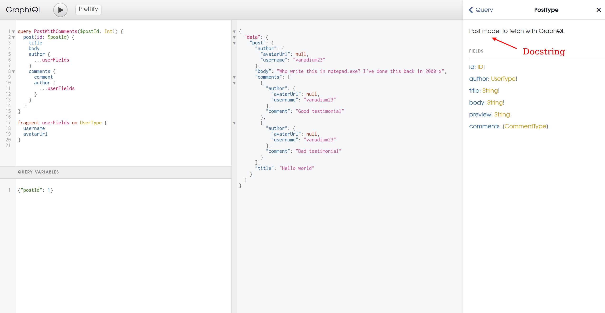

## Blog backend example with GraphQL

This is a sample app for showing GraphQL API on blog.
You can see full presentation about it on [MoscowPyton](http://www.moscowpython.ru/meetup/47/the-ajax-the-rest-and-the-graphql/).

### Try in docker

1. You need [docker-composer](https://docs.docker.com/compose/install/) to be installed
2. Execute command: `docker-compose up`
3. After message `https://docs.docker.com/compose/install/` go to https://localhost:8000/graphql
4. Feel free to explore query with GraphiQL

**ATTENTION!** Sqlite database is generated on docker build stage, and all your changes will be made inside container.

### For local development

1. Create virtualenv with `python -m venv .venv`
2. Activate virtualenv `. .venv/bin/activate`
3. Install requirements `pip install -r requirements.txt`
4. Change directory to app `cd app/`
5. Run migrations `./manage.py migrate`
6. Load sample data `./manage.py loaddata blog`
7. Run server `./manage.py runserver`
8. Go to https://localhost:8000/graphql

### GraphiQL view

